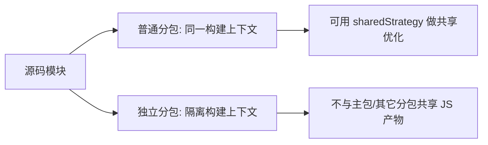
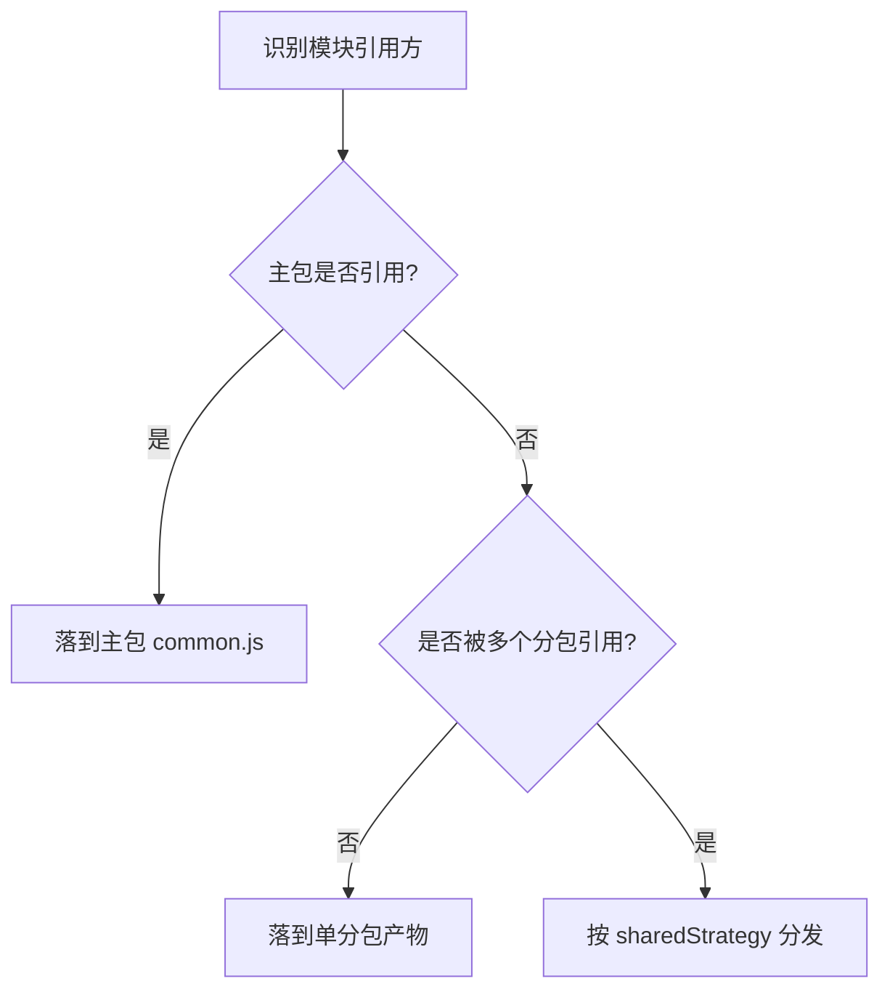
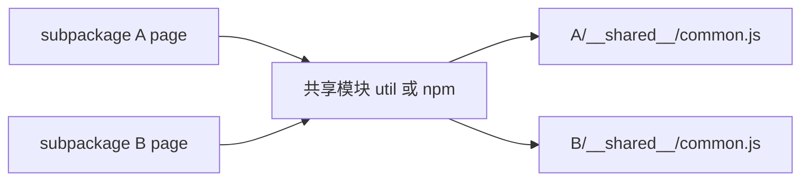
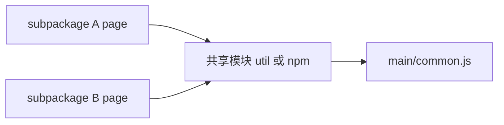
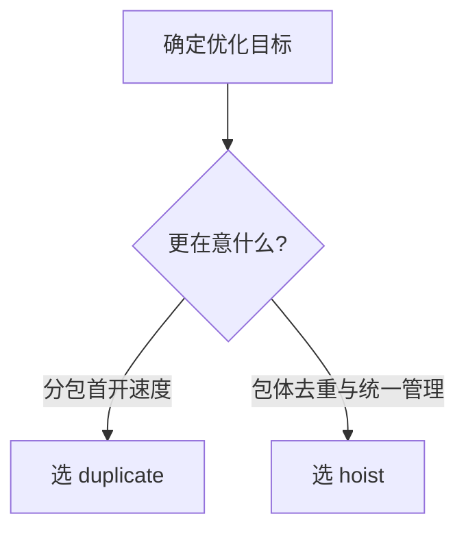
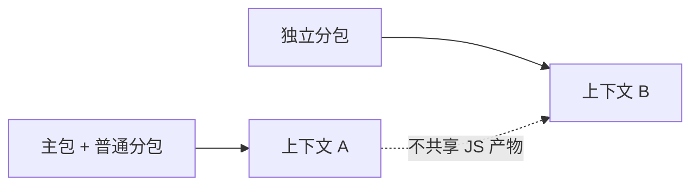
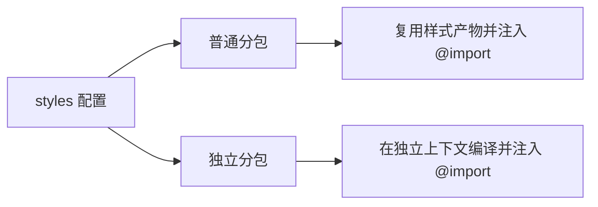

# 分包指南

微信小程序的分包机制在 `weapp-vite` 中得到完整支持。本页帮你快速搞清楚两件事：

- **普通分包 vs 独立分包** 有什么区别（哪些能互相引用、哪些不能）
- **Weapp-vite 会怎么分发产物**（共享代码/依赖/样式会落到哪里）

如果你需要原理级配置（`weapp.subPackages`、`weapp.chunks` 等），请继续阅读 [配置文档 · 分包配置](/config/subpackages.md)、[配置文档 · 共享 Chunk 配置](/config/chunks.md) 与 [配置文档 · Worker 配置](/config/worker.md)。

先记住 3 句话：

- **只想开启分包**：直接沿用官方 `app.json.subPackages` 写法即可，Weapp-vite 会识别并按分包输出。
- **想共享主题/基础样式**：用 [`weapp.subPackages[].styles`](/config/subpackages.md#subpackages-styles) 交给构建器注入，别手写一堆相对路径 `@import`。
- **想控制共享代码怎么落盘**：关注 `weapp.chunks.sharedStrategy`（`duplicate` vs `hoist`）。

官方说明可参考：[分包加载 - 微信官方文档](https://developers.weixin.qq.com/miniprogram/dev/framework/subpackages.html)。以下内容聚焦于 `weapp-vite` 的行为和调优手段。

::: tip 分包配置入口
通过 [`weapp.subPackages`](/config/subpackages.md#weapp-subpackages) 可以为每个 `root` 单独开启独立编译、注入 `inlineConfig`、覆盖自动组件导入和共享样式。若还要控制 npm 依赖落位，请配合 [`weapp.npm.subPackages`](/config/npm.md#主包--分包依赖落位) 使用。
:::

> [!NOTE]
> 文档里提到的 **Rolldown** 是 `weapp-vite` 内置的打包器：语法与 Vite/Rollup 插件体系兼容，但针对小程序做了额外的“分包产物分发”优化。可以把它看作「为小程序量身定制的 Rollup」；同一个 Rolldown 上下文意味着编译出的模块、样式和资源可以互相复用。

先看总览模型：



## 普通分包

普通分包会被视为和整个 `app` 是一个整体：主包 + 所有普通分包在**同一个 Rolldown 上下文**里构建，因此“共享/复制模块”这类优化是可行的。

微信运行时的限制（简化版）：

- `packageA` 不能直接 `require` `packageB` 的 JS，但可以引用主包与自身分包内的 JS。（使用“分包异步化”时此限制会放宽）
- `packageA` 不能引用 `packageB` 的模板（WXML），但可以引用主包与自身分包内的模板。
- `packageA` 不能直接使用 `packageB` 的静态资源，但可以使用主包与自身分包内的资源。

### 代码产物的位置（核心 4 条）

1. 模块只被一个分包引用：产物只在该分包内。
2. 模块被多个分包引用且主包不引用：由 `sharedStrategy` 决定落位。
3. 模块被主包和任一分包同时引用：统一进入主包 `common.js`。
4. 分包 A 不能直接引用分包 B 的源码：需先抽到主包或公共目录。



### sharedStrategy = duplicate（默认）

适合“分包首开优先”。跨分包共享模块会复制到各分包共享产物，避免回主包拉取。



### sharedStrategy = hoist

适合“减少重复代码优先”。跨分包共享模块统一提升到主包 `common.js`。



### 何时选 duplicate / hoist



### 精细化参数（按需开启）

- `forceDuplicatePatterns`：当导入图里出现“伪主包引用”时，强制某些目录仍按分包复制。
- `duplicateWarningBytes`：给 `duplicate` 的冗余体积设置告警阈值。

```ts
import { defineConfig } from 'weapp-vite/config'

export default defineConfig({
  weapp: {
    chunks: {
      sharedStrategy: 'duplicate', // 或 'hoist'
      // forceDuplicatePatterns: ['action/**'],
      // duplicateWarningBytes: 768 * 1024,
    },
  },
})
```

## 独立分包

独立分包和整个 `app` 是隔离的：它们会在**不同的 Rolldown 上下文**里构建，因此不会和主包/其他分包共享复用的 JS 代码。



- **独立分包不能依赖主包和其他分包的内容**，包括 JS、模板、WXSS、自定义组件、插件等。（使用“分包异步化”时，JS/自定义组件/插件会放宽）
- 主包的 `app.wxss` 对独立分包无效：不要依赖主包全局样式。
- `App` 只能在主包里定义：独立分包里不要定义 `App()`，否则行为不可预期。
- 独立分包中暂时不支持使用插件。

### 单独开发某个分包（把它当成独立分包）

当你想“只专注开发某个分包”（例如一个业务域由独立小组交付、或希望尽量隔离主包依赖）时，推荐把该分包按 **独立分包** 的方式组织与编译：运行时隔离、构建时独立上下文、依赖/样式/组件策略也能只对这个分包生效。

1. 在 `app.json` 里把目标分包标记为 `independent: true`（并确保分包 `pages` 指向你要调试的页面）：

```jsonc
// src/app.json
{
  "pages": ["pages/index/index"],
  "subPackages": [
    {
      "root": "packages/order",
      "pages": ["pages/index", "pages/detail"],
      "independent": true,
      // 可选：分包级入口（基于 root 的相对路径），用于放分包初始化逻辑
      "entry": "index.ts"
    }
  ]
}
```

2. 在 `vite.config.ts` 里为该 `root` 配置 `weapp.subPackages`（关键是 `independent`，其余按需）：

```ts
import { defineConfig } from 'weapp-vite/config'

export default defineConfig({
  weapp: {
    subPackages: {
      'packages/order': {
        independent: true,
        inlineConfig: {
          // 在这里添加独立分包的大包配置
          define: {
            'import.meta.env.ORDER_DEV': JSON.stringify(true),
          },
        },
      },
    },
  },
})
```

> [!TIP]
> 如果你不想把“独立分包开发”的配置长期留在主配置里，可以单独新建一个 `vite.config.order.ts`，再用 `wv dev -c vite.config.order.ts` 运行；生产构建仍用默认的 `vite.config.ts`。

## 分包样式共享

[`weapp.subPackages[].styles`](/config/subpackages.md#subpackages-styles) 能把重复的 `@import` 交还给构建器处理：声明一次主题、设计令牌或基础布局，普通分包与独立分包都会在生成样式时自动插入对应的共享入口。



> [!TIP]
> 分包根目录下若存在 `index.*` / `pages.*` / `components.*`（默认扫描 `.wxss`/`.css`），Weapp-vite 会自动识别它们作为共享入口，零配置即可复用。

```ts
import { defineConfig } from 'weapp-vite/config'

export default defineConfig({
  weapp: {
    subPackages: {
      'packages/member': {
        // 普通分包：共享主题变量和页面级样式
        styles: [
          'styles/tokens.css',
          { source: 'styles/layout.wxss', scope: 'pages' },
        ],
      },
      'packages/offline': {
        independent: true,
        // 独立分包：会在独立上下文重新编译并注入 @import
        styles: [
          {
            source: 'styles/offline-theme.scss',
            include: ['pages/**/*.wxss', 'components/**/*.wxss'],
          },
        ],
      },
    },
  },
})
```

- 普通分包与主包共享 Rolldown 上下文，样式产物只生成一次，并在分包页面/组件头部自动注入 `@import`。
- 独立分包会在专属上下文重新编译同一份源文件，保持样式同步且无需手动维护相对路径。
- `scope` / `include` / `exclude` 可精准控制注入范围，配合 HMR 调试体验与主包一致。

更多细节（如产物位置与对象写法）可查看[配置文档 · 样式共享实战](/config/subpackages.md#subpackages-styles)。

### 调试建议

1. 确认 `app.json` 中的 `independent: true` 是否与 `vite.config.ts` 中的 `weapp.subPackages` 保持一致。
2. 利用 `weapp.debug.watchFiles` 查看产物位置，确认独立分包是否生成独立的 `miniprogram_npm`。
3. 如果分包引用到了主包路径，构建会报错提示，请及时调整引用方式或拆分公共模块。

### 分析产物布局

快速核对“源码最终落在主包 / 分包 / 共享 chunk”的最短路径：

```json
{
  "scripts": {
    "analyze": "wv analyze"
  }
}
```

然后执行：

```bash
pnpm run analyze
```

默认会输出人类可读摘要。需要对接 CI 或自定义检查时，用 JSON 模式：

```bash
pnpm run analyze -- --json --output report/analyze.json
```

输出文件会包含主包、分包、共享 chunk 与源码映射，便于做体积预警和规则校验。

## 常见问题

- **本地运行时报路径错误？** 检查页面是否引用了其他分包的资源，或在 `weapp.chunks` 中启用了与你项目不符的策略。
- **产物体积过大？** 使用 `weapp.npm.mainPackage.dependencies` 与 `weapp.npm.subPackages.<root>.dependencies` 精确声明主包/分包 npm 依赖落位。
- **想在分包中调试 Worker？** 记得同时在 `weapp.worker` 中声明入口，并确保 Worker 文件位于对应分包目录。
