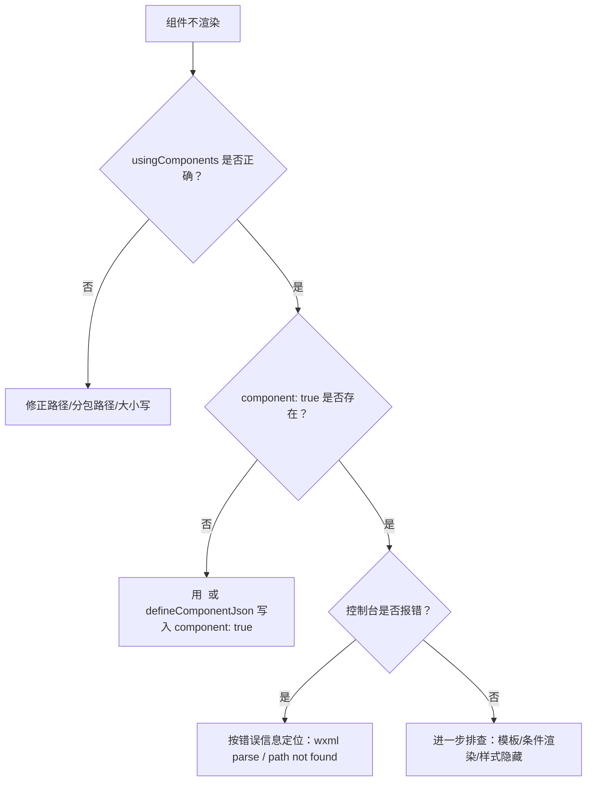

# Vue SFC：调试与排错

## 最佳实践与限制

- 使用小程序组件/事件名：模板中的 `<view>`、`<button>`、`@tap` 等会在构建时转为原生写法。
- 避免 DOM 专属 API（`window/document`）；需用小程序 API（如 `wx.request`）。
- 样式选择器遵循小程序规范；`scoped` 样式会编译为符合小程序前缀的选择器。
- 若使用 `<slot>`，保持与小程序组件 slot 语义一致。
- 需要分享/朋友圈/收藏能力时，请按微信官方实现页面回调（`onShareAppMessage/onShareTimeline/onAddToFavorites`），并在需要时调用 `wx.showShareMenu()` 配置菜单项。

## 常见问题

### 1) 组件不渲染

优先按这个顺序检查：

- `usingComponents` 是否声明、路径是否正确（注意分包路径与大小写）。
- `component.json` 是否包含 `component: true`（组件必须是组件）。
- 开发者工具控制台是否提示 “usingComponents not found / component path not found / wxml parse error”。

### 2) 状态不更新

- 确认响应式 API 来自 `wevu`（不是 `vue`）。
- 确认你更新的是响应式值（例如 `ref.value`）。
- 确认模板确实依赖了该状态（否则更新不会反映到 UI）。

### 3) hooks 不触发（滚动/分享/触底等）

- hooks 必须在 `setup()` **同步阶段**注册（`await` 后注册会报错或失效）。
- 分享/朋友圈/收藏等能力是否满足微信官方触发条件（菜单项、`open-type="share"`、`wx.showShareMenu()` 等）。

### 4) v-model 行为不符合 Vue 预期

回到“模板与指令”章节的 `v-model` 限制：它是小程序“赋值表达式事件”，不是 Vue 的完整 v-model 语义（参数/修饰符等）。

更强的双向绑定方案请参考：`/wevu/runtime` 的 `bindModel` 部分。
