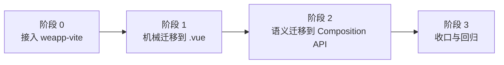

# 从原生小程序迁移到 Vue SFC（详细指南）

这是一份面向实际项目的迁移手册，不是概念介绍。目标是让你在**不重写业务**的前提下，把原生小程序稳定迁移到 `weapp-vite + wevu + Vue SFC`。

适用场景：

- 线上已有原生小程序，想提升工程效率与可维护性。
- 新项目计划直接采用 Vue SFC 写法，同时保留小程序原生能力。

## 迁移目标与验收标准

建议先明确“迁移完成”意味着什么，避免只完成了语法替换。

- 功能等价：核心页面流程（浏览、下单、支付、售后）行为与原版一致。
- 稳定性提升：常见空值场景不再出现 `map/forEach of undefined`。
- 结构升级：页面和组件统一为 `.vue` + `<script setup lang="ts">`。
- 可持续迭代：新增需求不再依赖 `setData` 大对象回写。
- 工程闭环：`build + 定向 e2e` 可覆盖关键链路。

## 迁移前准备（必须做）

### 1. 版本与工程基线

- 升级到 `weapp-vite@6.x`（Vue SFC 支持前提）。
- 安装并启用 `wevu` 运行时。
- 确认 `tsconfig.app.json` 已配置：
  - `"vueCompilerOptions.plugins": ["weapp-vite/volar"]`
  - `"vueCompilerOptions.lib": "wevu"`

### 2. 冻结阶段策略

迁移周期内，建议对核心页面采用“冻结功能、只修缺陷”的策略。

- 先控制变量，再改技术栈。
- 每次迁移只涉及一个页面族（如订单、优惠券），避免并发大改。

### 3. 建立对照样本

至少挑 1 个“中等复杂度页面”做试点：

- 有列表渲染（`map/forEach`）
- 有异步请求
- 有页面参数（`onLoad(query)`）
- 有导航/分享/滚动等页面事件

## 总体迁移路线（推荐 4 阶段）



### 阶段 0：只替构建链路，不改业务行为

先接入 `weapp-vite` 并保证原功能可跑，不立即重构逻辑。

验证最小闭环：

- `pnpm build`
- 在开发者工具中打开并手测 1 到 2 个核心页面

### 阶段 1：机械迁移（重点是“等价”）

先把原 `js + wxml + wxss + json` 聚合成单个 `.vue`，不追求代码优雅。

### 阶段 2：语义迁移（重点是“可维护”）

把 `this.data + this.setData + methods` 逐步替换为 `ref/reactive/computed/watch`。

### 阶段 3：收口（重点是“可持续”）

统一风格、补齐测试、清理历史写法，沉淀迁移规范。

## 原生到 Vue SFC 映射表（高频）

| 原生小程序                 | Vue SFC / wevu 对应                                                  | 迁移建议                             |
| -------------------------- | -------------------------------------------------------------------- | ------------------------------------ |
| `Page({...})`              | `<script setup>` + `definePageJson` + wevu hooks                     | 页面不再写原生构造器                 |
| `Component({...})`         | `<script setup>` + `defineComponentJson` + `defineProps/defineEmits` | 组件声明聚合到 SFC                   |
| `data: {}`                 | `ref/reactive`                                                       | 细粒度状态更易维护                   |
| `this.setData({...})`      | 直接赋值：`state.xxx = y`                                            | 由 wevu 负责最小更新                 |
| `onLoad/onShow/onHide/...` | `onLoad/onShow/onHide/...`（从 `wevu` 导入）                         | 生命周期迁移成本低                   |
| `observers`                | `watch` / `watchEffect`                                              | 逻辑更明确，易测试                   |
| `properties`               | `defineProps`（推荐）或兼容 `properties`                             | 新代码优先 Vue 风格                  |
| `triggerEvent`             | `defineEmits` + `emit(...)`                                          | 类型更清晰                           |
| `usingComponents`          | `definePageJson/defineComponentJson` 或 `<json>`                     | 不要在脚本里 `import` 注册小程序组件 |

## 实操：从 4 文件迁移为 1 个 SFC

### 迁移前（原生页面）

```js
// pages/coupon/coupon-activity-goods/index.js
Page({
  data: {
    goods: [],
    detail: {},
  },
  onLoad(query) {
    const id = Number(query.id)
    this.id = id
    this.getCouponDetail(id)
    this.getGoodsList(id)
  },
  getGoodsList(id) {
    fetchGoodsList(id).then((goods) => {
      this.setData({ goods })
    })
  },
})
```

### 迁移后（Vue SFC 页面）

```vue
<script setup lang="ts">
import { onLoad, ref } from 'wevu'
import { fetchGoodsList } from '../../../services/good/fetchGoods'

definePageJson(() => ({
  navigationBarTitleText: '活动商品',
  usingComponents: {
    'goods-list': '/components/goods-list/index',
  },
}))

const goods = ref<any[]>([])
const couponId = ref<number>(0)

onLoad(async (query) => {
  couponId.value = Number(query?.id ?? 0)
  await getGoodsList(couponId.value)
})

async function getGoodsList(id: number) {
  const list = await fetchGoodsList(id)
  goods.value = Array.isArray(list) ? list : []
}
</script>

<template>
  <goods-list :goods-list="goods" />
</template>
```

> 迁移第一步允许“结构升级但逻辑不重构”。先跑通，再优化。

## 两种落地策略：渐进式 vs 直接式

### 方案 A：渐进式（推荐）

先用 `<script setup>` + `defineOptions({...})` 保持原对象风格，再逐步迁移到组合式 API。

适合：存量页很多、业务变更频繁、团队迁移经验不足。

### 方案 B：直接式

一步到位改成 `ref/reactive/watch + hooks`。

适合：页面规模小、测试完善、迁移窗口集中。

## 最容易出错的 8 个点（含修复方式）

### 1. `map/forEach of undefined`

根因：接口字段为空、类型不稳定、参数解析失败。

修复：

- 所有列表统一 `Array.isArray` 兜底。
- JSON 参数反序列化加 `try/catch`。
- 模板里避免对可空对象深链访问。

```ts
const skuDetailVos = Array.isArray(ele.skuDetailVos) ? ele.skuDetailVos : []
const specs = Array.isArray(item.skuSpecLst)
  ? item.skuSpecLst.map(s => s?.specValue).filter(Boolean)
  : []
```

### 2. 组件不渲染

根因：只在脚本里 `import`，没有写 `usingComponents`。

修复：把注册写到 `definePageJson/defineComponentJson` 或 `<json>`。

### 3. `v-model` 行为不符合预期

根因：小程序不是 DOM 事件模型，且存在标签映射限制。

修复：复杂组件改为显式 `:value` + `@input/@change`；必要时使用 `useBindModel`。

### 4. 生命周期没触发

根因：迁移后把页面事件写成普通函数，未通过 wevu hooks 注册。

修复：从 `wevu` 导入 `onLoad/onPageScroll/onShareAppMessage/...`。

### 5. 页面参数类型错乱

根因：`query` 全是字符串，直接当 number/object 使用。

修复：统一做 parse 层和默认值层。

### 6. 本地开发能跑，但构建后页面崩溃

根因：只验证了 dev 场景，没有验证 build 产物与真机行为。

修复：每轮迁移都执行“开发调试通过 -> 构建验证通过 -> 真机关键路径回归”。

### 7. 一次迁移太多页面导致回滚困难

根因：提交粒度过大。

修复：按“页面族”迁移，每次只处理一个业务域并可单独回滚。

### 8. 先重构再迁移，问题难定位

根因：把“技术迁移”和“业务重构”耦合。

修复：先机械迁移，再结构优化。

## 推荐目录与分层（迁移后）

建议每个页面按“页面 SFC + 同目录服务/工具”组织，避免继续堆在大 `index.vue`。

```text
pages/order/order-confirm/
  index.vue
  pay.ts
  mapper.ts
  guards.ts
```

拆分规则：

- `mapper.ts`：接口 DTO -> 视图模型转换。
- `guards.ts`：空值保护、参数合法化、兜底逻辑。
- `pay.ts`：支付等副作用流程。

## 页面迁移清单（可直接执行）

### 清单 A：机械迁移

1. 合并 `index.js/wxml/wxss/json` 到 `index.vue`。
2. 保留原函数名与流程，不动业务逻辑。
3. 补齐 JSON 配置（导航栏、组件注册、页面配置）。
4. build 并手测页面主路径。

### 清单 B：语义升级

1. 用 `ref/reactive` 替代 `this.data`。
2. 用直接赋值替代 `setData`。
3. 用 `watch/watchEffect` 替代 `observers`。
4. 抽离 `mapper/guards`，减少页面脚本复杂度。

### 清单 C：发布前联调

1. 把迁移页面按真实用户路径串起来联调一遍（进入、操作、返回、再进入）。
2. 对核心接口做异常场景验证（空数组、空对象、字段缺失、接口超时）。
3. 确认构建产物在开发者工具与真机表现一致。

## 验证策略（从小到大）

### 1. 单页面冒烟

- 进入页面
- 请求成功/失败分支
- 操作按钮
- 页面返回与再次进入

### 2. 目标构建验证

```bash
pnpm build
```

### 3. 关键链路 e2e

只覆盖高价值路径，不建议迁移阶段就跑全量：

- 下单确认
- 优惠券活动商品
- 地址选择/回填

## 团队协作建议（通用）

- 一次提交只做一类改动：迁移或重构二选一。
- 每次改动都要记录“迁移前后行为对照”和“回滚点”。
- 页面新增或调整后，及时更新团队调试文档与常用入口配置。

## 最终验收（Definition of Done）

当以下条件都成立，迁移可以视为完成：

- 核心页面已迁移到 `<script setup lang="ts">`，不再使用 `Page/Component` 原生构造器。
- 页面逻辑不依赖大面积 `setData`，状态更新路径可追踪。
- 常见空值崩溃点（数组/对象）有统一防御策略。
- 开发调试、构建产物、真机表现三者一致。
- 有最小 e2e 用例覆盖关键业务链路。

## 延伸阅读

- [Vue SFC：基础与组成](/wevu/vue-sfc/basics)
- [Vue SFC：配置与宏](/wevu/vue-sfc/config)
- [Vue SFC：模板与指令](/wevu/vue-sfc/template)
- [Vue SFC：调试与排错](/wevu/vue-sfc/troubleshoot)
- [运行时与生命周期](/wevu/runtime)
