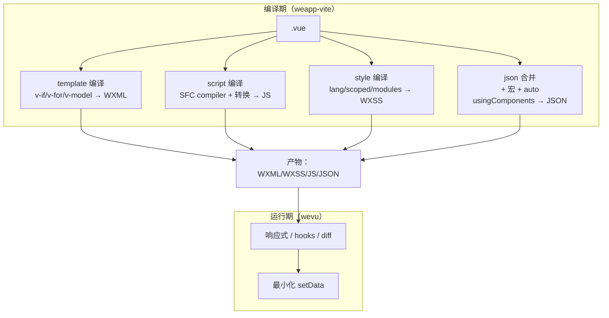
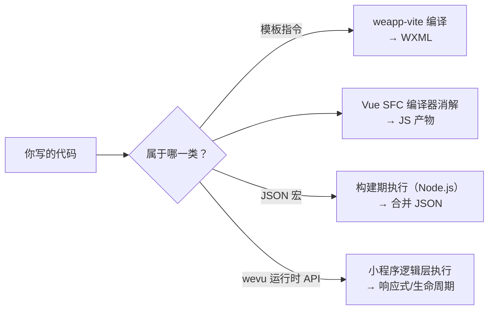

# Vue SFC：基础与组成

## Vue SFC = 编译期（weapp-vite）+ 运行期（wevu）

在小程序里写 Vue SFC，建议把心智模型拆成两段：

- **编译期（weapp-vite）**：负责把 `.vue` 拆解/编译为小程序产物（WXML/WXSS/JS/JSON），并做模板语法（如 `v-if/v-for/v-model`）到 WXML 的转换。
- **运行期（wevu）**：负责响应式、生命周期 hooks、快照 diff 与最小化 `setData`，让你用 Vue 3 风格的 Composition API 写业务逻辑。



因此：

- “模板能不能写”看编译器规则（本章主要讲这个）。
- “状态为什么不更新 / hooks 为什么不触发”通常是运行时使用方式问题（请对照 `/wevu/runtime` 与 `/wevu/compatibility`）。

## SFC 组成速查

在 weapp-vite 里，一个 `.vue` 最终会被拆成小程序的 `wxml/wxss/js/json` 四件套。各个块大致对应如下：

| SFC 块                        | 你写什么                                                                         | 主要发生阶段                                     | 对应小程序产物                                            |
| ----------------------------- | -------------------------------------------------------------------------------- | ------------------------------------------------ | --------------------------------------------------------- |
| `<template>`                  | 视图结构、数据绑定、事件、指令（如 `v-if/v-for/v-model`）                        | 编译期（模板编译）                               | `*.wxml`                                                  |
| `<script setup>` / `<script>` | 业务逻辑、响应式状态、事件处理、生命周期 hooks                                   | 编译期（SFC 编译 + weapp-vite 转换）→ 运行期执行 | `*.js`                                                    |
| `<style>`                     | 样式（支持 `lang`，支持 `scoped`/CSS Modules）                                   | 编译期（样式编译）                               | `*.wxss`                                                  |
| `<json>`（自定义块）          | 页面/组件配置：`usingComponents`、`navigationBarTitleText`、`component: true` 等 | 编译期（配置块编译/合并）                        | `page.json` / `component.json` / `app.json`（按文件类型） |

> 说明：weapp-vite 只识别 SFC 中的 `<json>` 自定义块用于生成配置；其他自定义块不会参与小程序产物生成（除非你的项目额外加了插件链路处理它们）。

## 宏与指令：哪些是编译时，哪些是运行时

很多“看起来像函数/语法糖”的东西，其实属于不同层级；把它们分清，排查问题会快很多：

| 类别                               | 例子                                                                                                            | 阶段                   | 你需要知道的点                                                                                                              |
| ---------------------------------- | --------------------------------------------------------------------------------------------------------------- | ---------------------- | --------------------------------------------------------------------------------------------------------------------------- |
| 模板指令（Vue 语法）               | `v-if/v-else/v-for`、`v-show`、`v-model`、`v-bind`（`:`）、`v-on`（`@`）                                        | 编译期                 | 由 weapp-vite 把模板转换为 WXML；并非浏览器 DOM 事件模型（例如 `@click` 会被映射为小程序的 `tap`）。                        |
| `<script setup>` 编译宏（Vue SFC） | `defineProps/defineEmits/withDefaults/defineExpose/defineOptions/defineSlots/defineModel` 等（随 Vue 版本而定） | 编译期                 | 它们在编译时被消解，不是运行时函数：不用 `import`，也不能在非 `<script setup>` 里调用。                                     |
| Script Setup JSON 宏（weapp-vite） | `defineAppJson/definePageJson/defineComponentJson`                                                              | 构建期（Node.js）      | 在打包时执行并生成/合并小程序 JSON 配置；不能访问 `wx`、不能依赖运行时状态；同一 SFC 内只能用一种宏（详见“配置与宏”章节）。 |
| 运行时 API（wevu）                 | `ref/reactive/computed/watch`、`onMounted/onShow/onPageScroll/...`                                              | 运行期（小程序逻辑层） | 真正跑在小程序环境里，负责响应式与生命周期；相关 API 必须从 `wevu` 导入而不是 `vue`。                                       |



## 基础范式

- `wevu` 提供运行时：`defineComponent`（页面/组件统一使用）、`ref/reactive/computed/watch`、生命周期等。
- 推荐使用 Script Setup JSON 宏（build-time）注入小程序 App/Page/Component 配置；也可在 SFC `<json>` 块中编写静态配置。配合 `weapp-vite/volar` 获得智能提示。
- 模板语法与 Vue 3 基本一致（事件、v-if/v-for/class/style 绑定），构建时转为小程序原生 WXML。
- 样式使用 `<style lang="scss|less|css">`，构建后输出 `wxss`。
- 组件引入沿用小程序约定：在 `<json>` 的 `usingComponents` 中声明，脚本里不要用 ESModule `import` 引入组件。
- props 推荐：wevu 会把 Vue 风格的 `props` 规范化为小程序 `properties`，原生 `properties` 亦兼容。

## 页面与组件：如何区分

在微信小程序里，页面与组件都是“用 `Component()` 注册”的，但它们的 JSON 字段与生命周期事件并不一样。

- **页面**：通常位于 `src/pages/**/index.vue`，最终会出现在 `app.json` 的 `pages` 列表中（来源依赖你的路由/扫描策略）。
  - 页面配置用 `definePageJson()` 或 `<json>` 写（最终生成 `page.json`）。
  - 页面 hooks（滚动/分享/触底/下拉刷新等）只对页面生效。
- **组件**：通常位于 `src/components/**/index.vue`，通过页面/组件 JSON 的 `usingComponents` 使用。
  - 组件配置用 `defineComponentJson()` 或 `<json>` 写（最终生成 `component.json`），并确保 `component: true`。

组件最小示例（只展示关键字段）：

```vue
<!-- components/MyCard/index.vue -->
<script setup lang="ts">
defineComponentJson(() => ({
  component: true,
  options: { virtualHost: true },
}))
</script>

<template>
  <view class="card">
    <slot />
  </view>
</template>
```

## .vue 编写注意事项（示例前必看）

- `<script lang="ts">`：页面/组件均使用 `export default defineComponent({ setup() {...} })` 注册；组件推荐写 `props`（wevu 会转为小程序 `properties`），并在 `setup()` 里返回/暴露模板需要的数据与方法。
- `<script setup lang="ts">`：组合式语法糖，顶层定义的 ref/computed/函数会自动暴露到模板；如需声明 props/emits 使用 `defineProps/defineEmits`。
- 运行时 API 请从 `wevu` 导入（`ref/reactive/computed/watch`、生命周期钩子等），确保挂载到小程序生命周期与 `setData` diff。
- `usingComponents` 可写在 `<json>` 块，也可通过 Script Setup JSON 宏注入；脚本侧不要通过 `import` 注册小程序组件（见“配置与宏”章节）。
- 避免直接使用 `window/document` 等浏览器专属能力，需改用微信小程序 API；模板事件使用小程序事件名（`@tap` 等）。
