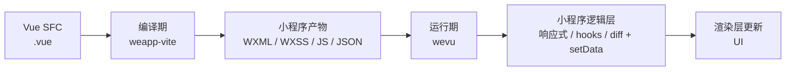

# 在 weapp-vite 中使用 Vue SFC

weapp-vite 内置了 Vue SFC 编译链路，配合 `wevu` 运行时即可用 Vue 风格开发小程序页面/组件，同时保持小程序能力（页面特性、分享、性能优化）。

> 适用版本：Vue SFC 仅在 `weapp-vite@6.x` 及以上可用，请先升级到 6 大版本。

## 快速开始

- 需要安装 `wevu`（任意包管理器均可 `add/install wevu`）。
- 官方模板已默认带上，手动集成时请先装依赖再继续。

## 心智模型

Vue SFC 在小程序里建议拆成两段：

- **编译期（weapp-vite）**：负责把 `.vue` 拆解/编译为小程序产物（WXML/WXSS/JS/JSON），并做模板语法（如 `v-if/v-for/v-model`）到 WXML 的转换。
- **运行期（wevu）**：负责响应式、生命周期 hooks、快照 diff 与最小化 `setData`，让你用 Vue 3 风格的 Composition API 写业务逻辑。

## 章节导航

- [基础与组成](/wevu/vue-sfc/basics)：SFC 各块作用、宏/指令的编译时与运行时、页面与组件区分等
- [配置与宏](/wevu/vue-sfc/config)：`usingComponents` 规则、`<json>` 与 Script Setup JSON 宏
- [模板与指令](/wevu/vue-sfc/template)：页面事件触发机制、`v-model` 支持范围与限制
- [class/style 绑定](/wevu/vue-sfc/class-style)：对齐 Vue 3 的 class/style 语法与运行时模式
- [示例](/wevu/vue-sfc/examples)：页面示例与组件 `v-model` 示例
- [调试与排错](/wevu/vue-sfc/troubleshoot)：常见问题定位与建议
- [Vue 3 写法对比](/wevu/vue-sfc/vue3-vs-weapp-sfc)：与 Vue 3 SFC 写法的相同点/不同点

迁移相关内容已独立成章节，请阅读：[从原生小程序迁移到 Vue SFC（详细指南）](/wevu/migration/from-native-to-vue-sfc)。
