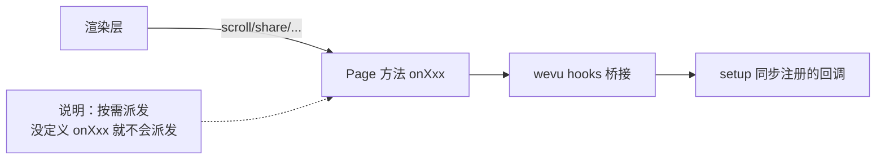

# Vue SFC：模板与指令

## 页面事件与生命周期：怎么触发

在小程序里，很多页面事件属于“按需派发”：

- 只有你定义了 `onPageScroll/onReachBottom/onPullDownRefresh/...` 这些页面方法，事件才会从渲染层派发到逻辑层。
- `wevu` 的 `onPageScroll/onShareAppMessage/...` hooks，本质也是在注册对应页面方法。



你通常不需要手写 `features.enableOnXxx`：

- **使用 weapp-vite 构建**：当编译器检测到你调用了对应 hooks，会在编译阶段自动补齐 `features.enableOnXxx = true`。
- **不使用 weapp-vite（或极端场景）**：才需要在 `defineComponent({ features: ... })` 里手动开启。

## v-model 支持范围与限制

`weapp-vite` 的 Vue 模板编译会把 `v-model="x"` 直接编译成**小程序的“赋值表达式事件”**（例如 `bind:input="x = $event.detail.value"`），因此它有一些明确限制：

- **表达式必须可赋值**：只建议写 `x` / `x.y` / `x[i]` 这类“左值”。不要写 `a + b`、函数调用、可选链（`a?.b`）等。
- **不支持 v-model 参数/修饰符**：`v-model:title`、`v-model.trim/.number/.lazy` 目前不会按 Vue 语义生效（会当作普通 v-model 处理，可能导致行为不符合预期）。
- **仅对部分表单元素做了专门映射**（见下表）。其他标签会退化为 `value + bind:input` 并给出编译警告。

当前内置映射（实现位于 `packages/weapp-vite/src/plugins/vue/compiler/template.ts`）：

| 标签                    | 绑定属性  | 事件          | 赋值来源                                    |
| ----------------------- | --------- | ------------- | ------------------------------------------- |
| `input`（默认/text）    | `value`   | `bind:input`  | `$event.detail.value`                       |
| `input type="checkbox"` | `checked` | `bind:change` | `$event.detail.value`（实现为 best-effort） |
| `input type="radio"`    | `checked` | `bind:change` | `$event.detail.value`                       |
| `textarea`              | `value`   | `bind:input`  | `$event.detail.value`                       |
| `select`                | `value`   | `bind:change` | `$event.detail.value`                       |
| `switch` / `checkbox`   | `checked` | `bind:change` | `$event.detail.value`                       |
| `slider` / `picker`     | `value`   | `bind:change` | `$event.detail.value`                       |

> 建议：复杂/非标准表单（如 `radio-group` / `checkbox-group`）或自定义组件，优先使用显式 `:value` + `@input/@change`，或者用 `wevu` 的 `ctx.bindModel()` 自己定义 `event/valueProp/parser`。

```mermaid
flowchart TB
  A[v-model=\"x\"] --> B{标签类型}
  B -->|input/textarea| C[value + bind:input<br/>x = $event.detail.value]
  B -->|switch/checkbox| D[checked + bind:change<br/>x = $event.detail.value]
  B -->|slider/picker| E[value + bind:change<br/>x = $event.detail.value]
  B -->|其它/自定义| F[退化为 value + bind:input<br/>并给出编译警告]
```

## 延伸阅读

- [class/style 绑定能力](/wevu/vue-sfc/class-style)
