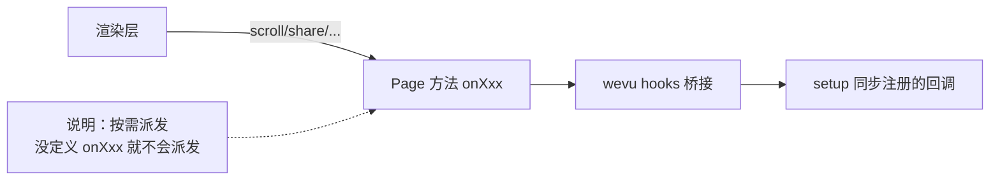

# Vue SFC：模板与指令

## 页面事件与生命周期：怎么触发

在小程序里，很多页面事件属于“按需派发”：

- 只有你定义了 `onPageScroll/onReachBottom/onPullDownRefresh/...` 这些页面方法，事件才会从渲染层派发到逻辑层。
- `wevu` 的 `onPageScroll/onShareAppMessage/...` hooks，本质也是在注册对应页面方法。


```mermaid
flowchart LR
  R[渲染层] -->|scroll/share/...| P[Page 方法 onXxx]
  P --> W[wevu hooks 桥接]
  W --> L[setup 同步注册的回调]

  Note[说明：按需派发<br/>没定义 onXxx 就不会派发] -.-> P
```

你通常不需要手写 `features.enableOnXxx`：

- **使用 Weapp-vite 构建**：当编译器检测到你调用了对应 hooks，会在编译阶段自动补齐 `features.enableOnXxx = true`。
- **不使用 Weapp-vite（或极端场景）**：才需要在 `defineComponent({ features: ... })` 里手动开启。

## v-model 支持范围与限制

`weapp-vite` 的 Vue 模板编译会把 `v-model="x"` 直接编译成**小程序的“赋值表达式事件”**（例如 `bind:input="x = $event.detail.value"`），因此它有一些明确限制：

- **表达式必须可赋值**：只建议写 `x` / `x.y` / `x[i]` 这类“左值”。不要写 `a + b`、函数调用、可选链（`a?.b`）等。
- **不支持 v-model 参数/修饰符**：`v-model:title`、`v-model.trim/.number/.lazy` 目前不会按 Vue 语义生效（会当作普通 v-model 处理，可能导致行为不符合预期）。
- **仅对部分表单元素做了专门映射**（见下表）。其他标签会退化为 `value + bind:input` 并给出编译警告。

当前内置映射（实现位于 `packages/weapp-vite/src/plugins/vue/compiler/template.ts`）：

| 标签                    | 绑定属性  | 事件          | 赋值来源                                    |
| ----------------------- | --------- | ------------- | ------------------------------------------- |
| `input`（默认/text）    | `value`   | `bind:input`  | `$event.detail.value`                       |
| `input type="checkbox"` | `checked` | `bind:change` | `$event.detail.value`（实现为 best-effort） |
| `input type="radio"`    | `checked` | `bind:change` | `$event.detail.value`                       |
| `textarea`              | `value`   | `bind:input`  | `$event.detail.value`                       |
| `select`                | `value`   | `bind:change` | `$event.detail.value`                       |
| `switch` / `checkbox`   | `checked` | `bind:change` | `$event.detail.value`                       |
| `slider` / `picker`     | `value`   | `bind:change` | `$event.detail.value`                       |

> 建议：复杂/非标准表单（如 `radio-group` / `checkbox-group`）或自定义组件，优先使用显式 `:value` + `@input/@change`，或者用 `wevu` 的 `ctx.bindModel()` 自己定义 `event/valueProp/parser`。

```mermaid
flowchart TB
  A[v-model=\"x\"] --> B{标签类型}
  B -->|input/textarea| C[value + bind:input<br/>x = $event.detail.value]
  B -->|switch/checkbox| D[checked + bind:change<br/>x = $event.detail.value]
  B -->|slider/picker| E[value + bind:change<br/>x = $event.detail.value]
  B -->|其它/自定义| F[退化为 value + bind:input<br/>并给出编译警告]
```

## v-bind 限制

`v-bind="object"`（对象展开）目前不会生成任何属性，等同于未绑定。
建议改为显式写法：`:<prop>="..."` + `@<event>="..."`。

## 具名插槽透传 wrapper

如果你在组件里把默认 `<slot />` 继续透传给子组件的具名插槽，例如：

```vue
<IssueCard>
  <template #header>
    <slot />
  </template>
</IssueCard>
```

编译器不能生成 `<slot slot="header" />`，也不能用 `<block slot="header"><slot /></block>` 作为替代。真实 WeChat DevTools 运行时里，`block` 路径会出现宿主 header，但转发进去的内容不会渲染。

微信平台默认产物会使用内部 `virtualHost` 组件作为 wrapper：

```wxml
<weapp-slot-wrapper slot="header">
  <slot />
</weapp-slot-wrapper>
```

如果需要回到旧版 `view` wrapper，可配置 `weapp.vue.template.slotFallbackWrapperStrategy: 'view'`，或显式配置 `slotFallbackWrapper: 'view'`。如果某个组件或某个具名插槽需要换成其他真实节点，可以在组件使用处声明静态 wrapper。组件内配置推荐使用普通 kebab-case 静态属性，避免和 Vue 指令参数语法混淆。

### 当前组件默认 wrapper

```vue
<template>
  <IssueCard slot-wrapper="cover-view">
    <template #header>
      <slot />
    </template>
    <template #footer>
      <slot name="footer" />
    </template>
  </IssueCard>
</template>
```

产物中所有普通具名插槽都会使用 `cover-view`：

```wxml
<IssueCard>
  <cover-view slot="header">
    <slot />
  </cover-view>
  <cover-view slot="footer">
    <slot name="footer" />
  </cover-view>
</IssueCard>
```

### 覆盖指定具名插槽

`slot-wrapper-footer` 只覆盖 `footer`，其他插槽继续使用 `slot-wrapper`。如果是在单个 slot 上临时覆盖，更推荐直接写在对应的 `<template #footer>` 上：

```vue
<template>
  <IssueCard slot-wrapper="cover-view">
    <template #header>
      <slot />
    </template>
    <template #footer slot-wrapper="view">
      <slot name="footer" />
    </template>
  </IssueCard>
</template>
```

产物：

```wxml
<IssueCard>
  <cover-view slot="header">
    <slot />
  </cover-view>
  <view slot="footer">
    <slot name="footer" />
  </view>
</IssueCard>
```

如果只想覆盖单个 slot，更推荐把配置写在对应的 `<template #xxx>` 上。这个写法最靠近 slot 内容，也最容易在模板里读懂：

```vue
<template>
  <IssueCard slot-wrapper="cover-view">
    <template
      #header
      slot-wrapper="text"
      slot-wrapper-class="slot-header"
      slot-wrapper-style="margin-top: 12px"
    >
      <slot />
    </template>
    <template #footer>
      <slot name="footer" />
    </template>
  </IssueCard>
</template>
```

产物：

```wxml
<IssueCard>
  <text slot="header" class="slot-header" style="margin-top: 12px">
    <slot />
  </text>
  <cover-view slot="footer">
    <slot name="footer" />
  </cover-view>
</IssueCard>
```

在 `<template #header>` 上配置时，属性仍写 `slot-wrapper` / `slot-wrapper-class` / `slot-wrapper-style` / `slot-single-root-no-wrapper`，不需要再带 `header` 后缀。它比父组件标签上的默认值和 `slot-wrapper-header` 更优先。

### 给生成的 wrapper 加 class/style

普通 `class` / `style` 仍然属于组件本身，不会被转移到编译器生成的 slot wrapper 上。如果要给 wrapper 加样式，需要使用 wrapper 虚拟属性：

```vue
<template>
  <IssueCard slot-wrapper="cover-view">
    <template #header slot-wrapper="cover-view" slot-wrapper-class="slot-default" slot-wrapper-style="padding: 8px">
      <slot />
    </template>
    <template
      #footer
      slot-wrapper="view"
      slot-wrapper-class="slot-footer"
      slot-wrapper-style="margin-top: 12px"
    >
      <slot name="footer" />
    </template>
  </IssueCard>
</template>
```

产物：

```wxml
<IssueCard>
  <cover-view slot="header" class="slot-default" style="padding: 8px">
    <slot />
  </cover-view>
  <view slot="footer" class="slot-footer" style="margin-top: 12px">
    <slot name="footer" />
  </view>
</IssueCard>
```

动态绑定也支持，但参数名仍然必须是静态的：

```vue
<IssueCard
  :slot-wrapper-class="headerClass"
  :slot-wrapper-style="headerStyle"
>
  <template #header>
    <slot />
  </template>
  <template #footer :slot-wrapper-class="footerClass">
    <slot name="footer" />
  </template>
</IssueCard>
```

指定插槽的 class/style 只覆盖对应属性。上例中 `footer` 在 `<template #footer>` 上覆盖了 class，但仍会继承默认的 `slot-wrapper-style`。

也可以用全局配置按组件和 slot 匹配：

```ts
import { defineConfig } from 'weapp-vite/config'

export default defineConfig({
  weapp: {
    vue: {
      template: {
        slotFallbackWrapper: {
          tag: 'view',
          attrs: {
            class: 'slot-wrapper',
          },
          rules: [
            { component: 'IssueCard', slot: 'header', tag: 'cover-view' },
            { componentName: 'HelloWorld', slot: 'header', tag: 'cover-view' },
            { component: 'IssueCard', slot: 'footer', attrs: { class: 'slot-footer' } },
            { component: /^Van/, slot: ['title', 'label'], tag: 'view' },
          ],
        },
      },
    },
  },
})
```

这里的 `component` 匹配使用处模板标签名，例如 `<IssueCard>`、`<issue-card>` 或 `<van-cell>`；它不是子组件自己的 `name`。如果要按子组件声明名匹配，子组件需要写静态 `defineOptions({ name })`，配置里使用 `componentName`：

```vue
<!-- components/IssueCard.vue -->
<script setup lang="ts">
defineOptions({
  name: 'HelloWorld',
})
</script>
```

```ts
import { defineConfig } from 'weapp-vite/config'

export default defineConfig({
  weapp: {
    vue: {
      template: {
        slotFallbackWrapper: {
          rules: [
            { componentName: 'HelloWorld', slot: 'header', tag: 'cover-view' },
          ],
        },
      },
    },
  },
})
```

`componentName` 需要编译器能解析到被引用的 Vue SFC，适用于 `<script setup>` import 和自动导入 resolver 返回 `sourceType: 'wevu-sfc'` / `.vue resolvedId` 的组件；原生小程序组件继续用 `component` 匹配模板标签名。

### 单根真实节点下推

如果某个插槽内容本身就是单个真实节点，可以用 `slot-single-root-no-wrapper-<slotName>` 尽量避免额外 wrapper：

```vue
<template>
  <IssueCard slot-single-root-no-wrapper-icon>
    <template #icon>
      <image src="/assets/icon.png" />
    </template>
  </IssueCard>
</template>
```

产物：

```wxml
<IssueCard>
  <image slot="icon" src="/assets/icon.png" />
</IssueCard>
```

如果内容是转发 `<slot />`，仍然会保留 wrapper：

```vue
<template>
  <IssueCard slot-single-root-no-wrapper-header>
    <template #header>
      <slot />
    </template>
  </IssueCard>
</template>
```

产物：

```wxml
<IssueCard>
  <weapp-slot-wrapper slot="header">
    <slot />
  </weapp-slot-wrapper>
</IssueCard>
```

### `block` 和内容承载限制

默认策略不会使用 `block`。如果显式配置 `slotFallbackWrapper: 'block'`，编译器会按原样输出：

```wxml
<IssueCard>
  <block slot="header">
    <slot />
  </block>
</IssueCard>
```

注意：`block` 在转发 `<slot />` 的部分 WeChat DevTools 运行时场景中会丢失内容，因此不作为默认值。显式启用时需要自行确认目标运行时和具体插槽内容可用。

你选择的 wrapper 还必须能承载实际内容。比如：

```vue
<template>
  <IssueCard>
    <template #header slot-wrapper="text">
      <view>Header</view>
    </template>
  </IssueCard>
</template>
```

会生成：

```wxml
<IssueCard>
  <text slot="header">
    <view>Header</view>
  </text>
</IssueCard>
```

`text` 不适合包裹 `<view>` 子节点，需要按宿主规则改用 `view`、`cover-view` 或已验证的自定义组件。

规则汇总：

- `slot-wrapper` 是当前组件所有普通具名插槽的默认 wrapper。
- `slot-wrapper-<slotName>` 只覆盖指定具名插槽。
- `slot-wrapper-class` / `slot-wrapper-style` 会给当前组件所有普通具名插槽 wrapper 加 class/style。
- `slot-wrapper-<slotName>-class` / `slot-wrapper-<slotName>-style` 只覆盖指定具名插槽 wrapper 的 class/style。
- 写在 `<template #slot>` 上的 `slot-wrapper` / `slot-wrapper-class/style` 是对应 slot 的就近覆盖，优先级高于父组件标签上的同名或带 slot 后缀配置。
- `slot-single-root-no-wrapper-<slotName>` 可以让指定插槽在单根真实节点场景下尽量下推 `slot="..."`。
- 全局 `slotFallbackWrapper.rules[].component` 匹配模板标签名，`componentName` 匹配子组件静态 `defineOptions({ name })`。
- `block` 会被编译器拒绝并回退到 `view`。
- 你选择的 wrapper 必须能承载实际内容。

## 延伸阅读

- [class/style 绑定能力](/wevu/vue-sfc/class-style)
